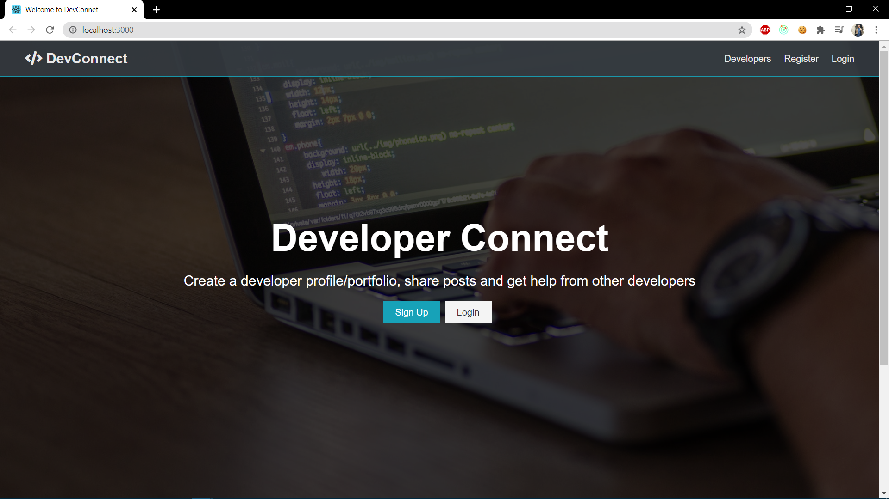
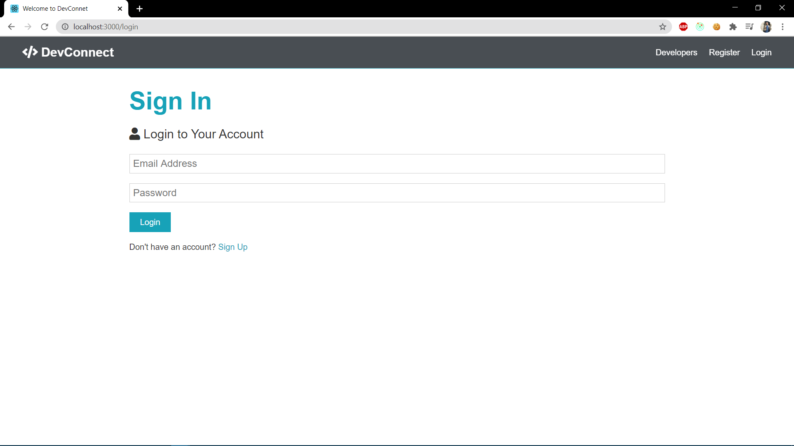
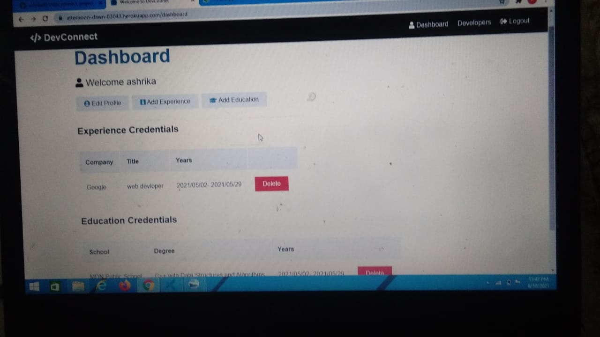
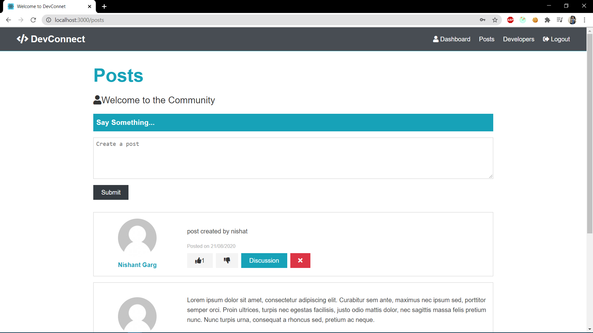
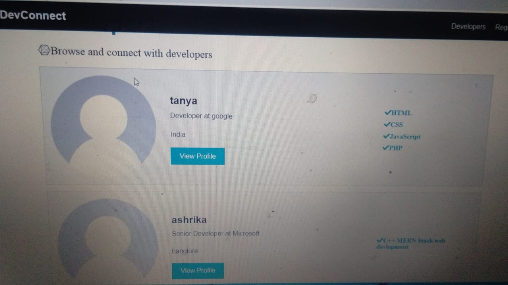
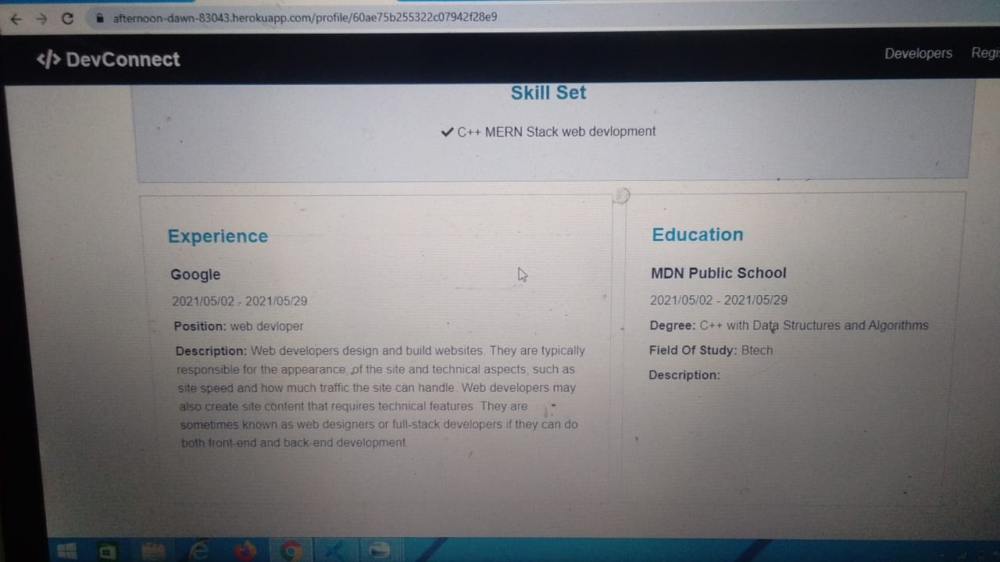

# Dev Connect

**It is basically a app that connects developers and enable them to create a developer profile.**

# Sample Images

## Home:

- Basic home page enables you to view profile without registering.

  

## Login Page:

## Register Page:

## Dashboard:

- Edit education,experience and profile information.
- Manage your Experience from here.

  

## Posts:

- All the posts posted by developers.
- Like and comment functionality.
- Add your own post.

  

## Developers:

- See all the developers present on Devconnect.

  

## Profile:

- See the profile of a single developer.

  

# Technology:

## Client:

- Reactjs

## Server:

- Nodejs
- ExpressJs
- Mongodb(atlas)
